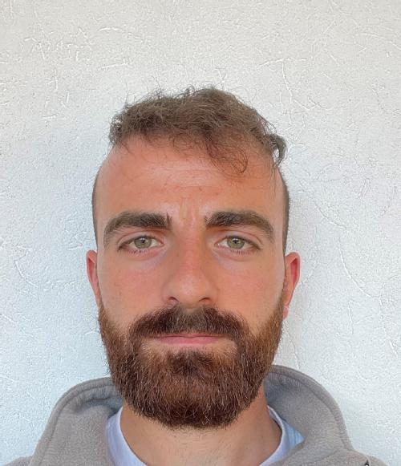

# Guglielmo Gattiglio

<meta http-equiv="refresh" content="0; url=http://guglielmogattiglio.com">

# Welcome to My Website!

This is the old version of the website. Feel free to browse the content, but check out the new version as well!

<!-- Pop-up HTML -->

    

        
This website has been moved to a new address. Visit the new version here:

        
<a href="http://guglielmogattiglio.com" target="_blank">http://guglielmogattiglio.com</a>

        <button id="popup-close" style="margin-top: 10px; padding: 10px 20px; background-color: #007BFF; color: white; border: none; border-radius: 4px; cursor: pointer;">Dismiss</button>
    

<!-- Pop-up JavaScript -->

I am a last-year PhD student in the [Warwick Mathematics and Statistics CDT](https://warwick.ac.uk/fac/sci/fromas) under the joint supervision of Prof. Lyudmila Grigoryeva and Prof. Massimiliano Tamborrino. My current research direction combines machine learning and parallel-in-time algorithms to solve differential equations numerically (Parareal). Recently, I have been working to extend this methods under the probabilistic numerics umbrella. In the past, I have worked on the generation of stochastic processes and learning of dynamical systems, and computational methods for Bayesian inference.

The most recent version of my CV is available [here](https://guglielmogattiglio.github.io/assets/misc/Guglielmo_Gattiglio_CV.pdf).

**Contact**: Guglielmo [dot] Gattiglio [at] warwick [dot] ac [dot] uk

### Education

 <table class="table" style="white-space: nowrap;width:100%;">
  <tbody>
  <tr>
      <td>2021 - 2025</td>
      <td>PhD in Statistics - University of Warwick (UK) 
          <i>Supervisors</i>: Prof. Massimiliano Tamborrino and Lyudmila Grigoryeva</td>
    </tr>
    <tr>
      <td>2019 - 2021</td>
      <td>MSc in Statistics, major in Data Science - Bocconi University (Italy) 
        <i>Thesis</i>: <em>Tempered Stochastic Search of Bayesian CART Models. 
        </em><i>Supervisor</i>: Prof. Giacomo Zanella</td>
    </tr>
    <tr>
      <td>2016 - 2019</td>
      <td> BSc in Economics and Computer Science - Bocconi University (Italy) 
        <i>Thesis</i>: <em>Machine Learning for Imbalanced Data.  An Application to Customers Complaints. 
        </em><i>Supervisor</i>: Prof. Daniele Durante</td>
    </tr>
    <tr>
      <td>2019 - 2019</td>
      <td>Exchange semester - Carnegie Mellon University, CMU (USA)</td>
    </tr>
  </tbody>
</table>

### Publications

Please note that only the papers containing a *Publication* link have undergone peer-review.

- G. Gattiglio and L. Grigoryeva and M. Tamborrino. *RandNet-Parareal: a time-parallel PDE solver using Random Neural Networks*, 2024. 38th Conference on Neural Information Processing Systems (NeurIPS 22024). ([ArXiv](https://arxiv.org/abs/2411.06225v1), [NeuriPS](https://openreview.net/forum?id=974ojuN0jU&referrer=%5Bthe%20profile%20of%20Lyudmila%20Grigoryeva%5D(%2Fprofile%3Fid%3D~Lyudmila_Grigoryeva1)))
- G. Gattiglio and L. Grigoryeva and M. Tamborrino. *Nearest Neighbors GParareal: Improving Scalability of Gaussian Processes for Parallel-in-Time Solvers*, 2024. ([ArXiv](https://arxiv.org/abs/2405.12182), In review)

### Awards

- Reproducibility award at the [Third BioInference Conference](https://bioinference.github.io/2024/), for [Nearest Neighbors GParareal: Improving Scalability of Gaussian Processes for Parallel-in-Time Solvers](https://github.com/Parallel-in-Time-Differential-Equations/Nearest-Neighbors-GParareal).
- Travel funding awarrd at the 38th Conference on Neural Information Processing Systems ([NeurIPS 22024](https://neurips.cc/Conferences/2024))

### Presentations

- [Nearest Neighbors GParareal: Improving Scalability of Gaussian Processes for Parallel-in-Time Solvers](assets/misc/nnGPara_Bioinference_Warwick_June_2024.pdf) - 7 June 2024 - [Third BioInference Conference](https://bioinference.github.io/2024/), hosted by the University of Warwick.
- [RWParareal: a time-parallel PDE solver using Random Weights Neural Networks](assets/misc/RWPara_pres_Exeter_May24.pdf) - 1 May 2024 - [Met Office](https://www.metoffice.gov.uk/), Exeter, UK.
- [Nearest Neighbor GParareal: Improving Scalability of Gaussian Processes for Parallel-in-Time Solvers](assets/misc/NNGP_pres_DEDS24.pdf) - 20 February 2024 - [International Conference: Differential Equations for Data Science 2024 (DEDS2024)](https://scheme.hn/deds2024/), online.
- [Nearest Neighbor GParareal: Improving Scalability of Gaussian Processes for Parallel-in-Time Solvers](assets/misc/NNGP_pres_Algorithms.pdf) - 8 February 2024 - [Algorithms & Computationally Intensive Inference seminar](https://warwick.ac.uk/fac/sci/statistics/news/algorithms-seminars/), University of Warwick.
- [Nearest Neighbor GParareal: Improving Scalability of Gaussian Processes for Parallel-in-Time Solvers](assets/misc/NNGP_Exeter_pres.pdf) - 31 January 2024 - [ExCALIBUR Workshop: Data Driven Algorithms](https://www.eventbrite.co.uk/e/excalibur-workshop-data-driven-algorithms-tickets-780794767167), University of Exeter.
- [Nearest Neighbor GParareal: Improving Scalability of Gaussian Processes for Parallel-in-Time Solvers](assets/misc/NNGP_pres_YRM.pdf) - 23 January 2024 - [Young Researchers Meeting (YRM)](https://warwick.ac.uk/fac/sci/statistics/news/yrm/), University of Warwick.
- [NN-GParareal: Improving Scalability of GParareal Using Nearest Neighbors](assets/misc/NNGP_pres_StGallen.pdf) - 21 November 2023 - St. Gallen University.

### Posters

- [RandNet-Parareal: a time-parallel PDE solver using Random Neural Networks](assets/misc/poster_NeurIPS_2024.pdf) - 13 December 2024 - [38th Conference on Neural Information Processing Systems](https://neurips.cc/Conferences/2024), Vancouver, Canada.

- [Nearest Neighbor GParareal: Improving Scalability of Gaussian Processes for Parallel-in-Time Solvers](assets/misc/poster_prob_num_school_Apr_24.pdf) - 24 April 2024 - [Probabilistic Numerics Spring School](https://probnumschool.org/pages/school.html), Southampton.
- [Generating Stochastic Processes using Echo State Networks and Maximum Mean Discrepancy](assets/misc/Lyudmila_sept_2022.pdf) - 13 April 2023 - annual conference of the statistics Warwick department.
- [Generating Stochastic Processes using Echo State Networks and Maximum Mean Discrepancy](assets/misc/Lyudmila_sept_2022.pdf) - 14 December 2022 - [AS&RU Partnership Day](https://warwick.ac.uk/fac/sci/statistics/asru/registration-page-2022n/), University of Warwick.
- [Generating Stochastic Processes using Echo State Networks and Maximum Mean Discrepancy](assets/misc/Lyudmila_sept_2022.pdf) - 25 October 2022 - [Young Researchers Meeting (YRM)](https://warwick.ac.uk/fac/sci/statistics/news/yrm/), University of Warwick.

### Teaching

- ST346: *Generalised Linear Models for Regression and Classification* - 2024 - University of Warwick,  Department of Statistics - bachelor level.

- ST227: *Stochastic Processes* - 2024 - University of Warwick,  Department of Statistics - bachelor level.

- ST228: *Mathematical Methods for Statistics and Probability* - 2023 - University of Warwick,  Department of Statistics - bachelor level.
- ST420: *Statistical Learning and Big Data* - 2023 - University of Warwick,  Department of Statistics - master level.
- ST202: *Stochastic Processes* - 2023 - University of Warwick,  Department of Statistics - bachelor level.

- EC140: *Mathematical Techniques B* - 2022 - University of Warwick, Department of Economics - bachelor level. 

- ST111: *Probability A* - 2022 - University of Warwick,  Department of Statistics - bachelor level.

-  ST112: *Probability B* - 2022 - University of Warwick,  Department of Statistics - bachelor level.

- IB9CS: *Big Data Analytics* - 2022 - University of Warwick, Warwick Business School (WBS) - master level.

- *Python Programming for Economics, Management and Finance* - 2020 - Bocconi University - bachelor level.

### Parareal Demo

[1D Example](assets/misc/parareal_1D.mp4). [2D Example (Brussellator)](assets/misc/parareal_brus2D.mp4).

[//]: # (Mathematical Techniques B module leader Alexander Dobson)

 Last Updated 7 June 2024

